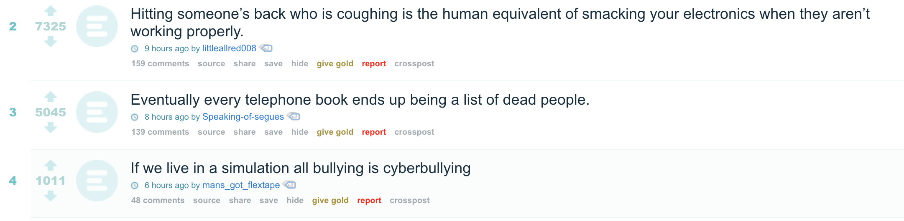
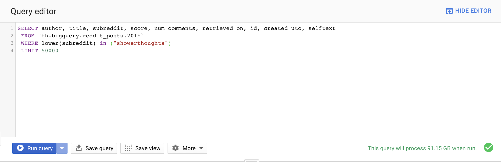
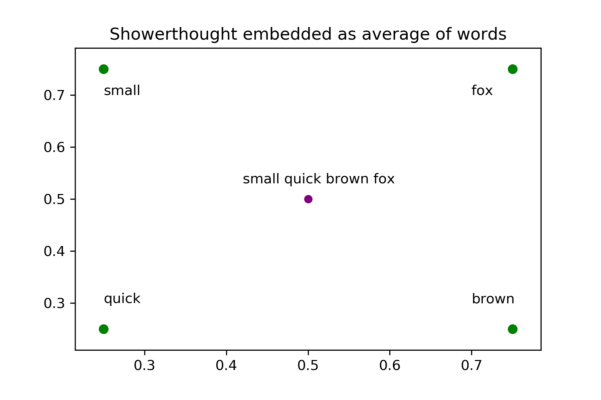
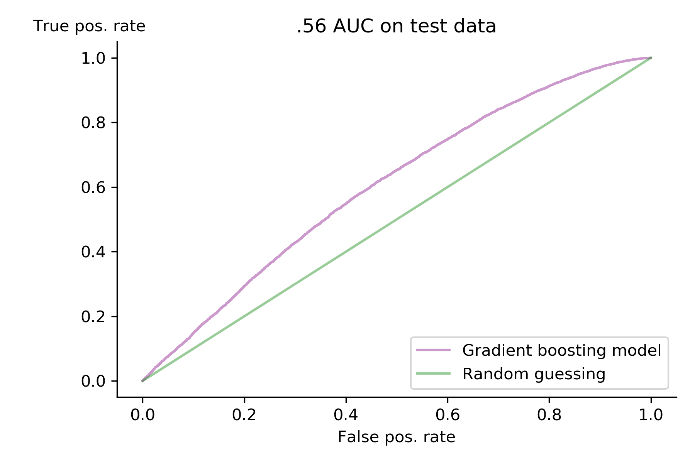

---
layout: post
title: Predicting a reddit submission's success using Word2vec
--- 

I usually browse [reddit's](www.reddit.com) unfiltered front page in my free time, but I always find myself cracking up at the posts from /r/showerthoughts. Highly upvoted submissions to /r/showerthoughts have that *je ne sais quoi* that other subreddits lack. A couple weeks ago, I decided that it'd be fun to try to distill that undefinable quality that makes showerthoughts so good using NLP and machine learning. 

|  | 
|:--:| 
| *The front page of showerthoughts as I write this* |

## Data
Using Google BigQuery, I retrieved data on 1,000,000 showerthoughts between 2015-2018. I made sure the most recent showerthoughts were submitted more than one month ago so every submission has at least a month to get upvotes. The important pieces of data were the title and the score the post received, but I also grabbed the timestamp of each submission.

BigQuery turned out to be surprisingly simple to use. A reddit user, /u/stuck_in_the_matrix, maintains a public dataset of all reddit submissions, comments,urls, etc. on BigQuery, allowing anyone to access reddit data with a simple SQL query. The free version of BigQuery only allows 1 TB of data to be processed per month, which turns out to not be very much, as each query has to process a lot of data to find the specific bits and pieces one wants. 1 TB was plenty for my purposes, though, and I was ready to move on to data processing. 

|  | 
|:--:| 
| *BigQuery's interface is very easy to use* |

I decided to split my showerthoughts in to two classes: success and failure. It turns out only 39% of submissions to /r/showerthoughts receive one or more upvotes, and the other 61% receive either no upvotes, or more downvotes than upvotes. This led to my definition for success: if your submission receives one upvote or more, it's considered a success! 

Using the Python library NTLK, I stemmed each showerthought's words to their base word, eg. "running" would become "run." I removed stop words such as "it", "the", and "is" from showerthoughts, as they tend not to add much to the meaning of a sentence. I tokenized my words in to unigrams, meaning "quick red fox" would be treated as "quick," "red," and "fox." 

## Modeling

My first approach was to use a method called Latent Dirichlet Allocation (LDA) to do what is referred to as topic modeling on my showerthoughts. This form of unsupervised learning creates a predetermined number of topics that appear in my showerthoughts, assigns each showerthought a probability that it belongs to each topic, and spits out the results to use as features in a supervised learning model. I decided on a random forest model as a way to quickly test results. Unfortunately, the features generated by LDA didn't help my model accurately predict success or failure, even aftering using a couple clustering algorithms to further refine my features.

I decided to switch directions and use a pre-trained Word2vec model from the University of Ghent in Belgium ([you can find their paper here](https://fredericgodin.com/papers/Named%20Entity%20Recognition%20for%20Twitter%20Microposts%20using%20Distributed%20Word%20Representations.pdf)) to reduce the complexity of my dataset. Word2vec is an algorithm that gets trained on a massive amount of data (400 million tweets in my case), and figures out a "logical" way to represent each word in a 400 dimensional vector space. By "logical," I mean you can add and subtract words from each other and the result sort makes sense: take the word "king," subtract "man" from it, and add "woman," and the result is "queen"! 

For each of my preprocessed showerthoughts, I took the constituent words and embedded them in a 400 dimensional vector space, added up each word's vector and divided by the number of words in the showerthought, effectively calculating the average representation of the words in a showerthought. I used this average to represent each document in my vector space. It was at this point that I decided I should use 10% of my dataset, as it took 11 hours just to embed 100,000 showerthoughts using word2vec. 

It felt good to have my documents firmly embedded in a vector space and ready to go in to a supervised classification model. I tried a multitude of different supervised classification models, including random forest, gradient boosting, logistic regression, K nearest neighbors, support vector machines, and naive bayes. Gradient boosting turned out to be the best model with .60 cross-validated AUC, but only had .56 AUC when predicting on test data. My precision and recall were .18 and .49 respectively. I used a variety of over and undersampling methods from imblearn, but couldn't increase my model's AUC.

## Conclusions

My model is only slightly better than random guessing. I can't say I was expecting a high AUC from my model going in to this project, but .56 is a little lower than I expected. There are several reasons my model didn't succeed at its job, but first and foremost, I think the problem is the way my Word2vec embedding is treating the words in a showerthought. Word2vec inherently does away with the ordering of words in a document, which is huge in the case of a showerthought. Showerthoughts aren't good because of the words that are in them, but rather are good because of the ordering and the writer presents them. My model is effectively taking the sentence "a towel gets wetter as it dries," and saying "dry towel wet" is the same thing. 

To improve classification of success and failure, I'd need to use a model that takes in to account the ordering and syntax of a showerthought. To do so I'd most likely use a recurrent neural network, probably a long short term memory model. These models excel when working with data that is ordered, like time series analysis or words in a sentence. 

I do think there are some changes to my existing model that could improve it. If I had to change one thing about the way I did this project, it would be to keep preprocessing to a minimum. Writers of successful showerthoughts choose their words carefully, including stop words! By removing words from showerthoughts willy-nilly I was taking away a large part of what a showerthought is, and I think a lot of meaning was lost in this step. 

Starting next week, I'll be working on the final project of the Metis bootcamp. I'm not totally sure what I'll end up doing, but I'm excited nonetheless!