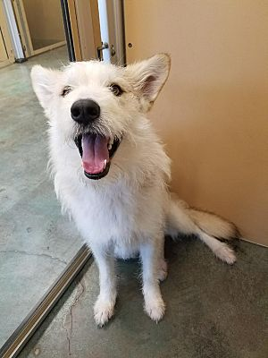
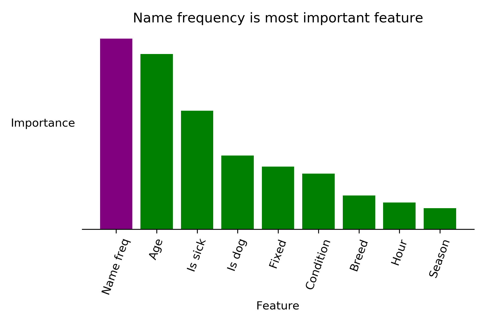

---
layout: post
title: How an animal's name affects its adoption potential
--- 

For my passion project at Metis, I wanted to do a project that falls under "data science for social good" umbrella. Don't get me wrong -- I'm very interested in using data science to solve business problems -- but I figured this was a good opportunity to focus all my energy towards a social problem. With this in mind, my goal was to build a tool that can help shelters identify animals that are less likely to be adopted. 

Once shelters have identified these animals, they can allocate more resources towards these animals to give them a better probability of getting adopted. If a shelter knows that an animal might have more trouble getting adopted, they might feature that animal on their website, or put them at the top of the list when recommending animals to people who have no idea what they want in an animal.

|  | 
|:--:| 
| *Kiara is up for adoption in the Seattle area!* |

## Data
I got my data from the Austin Animal Center, a shelter in Austin Texas. The dataset had 80,000 animals in it, with their intake information (age, breed, name, etc.) and their outcome information (adoption, euthanasia, death while in shelter, transfer to different shelter, etc.). I decided to break this in to a binary classification in which I classify an animal as either adopted or non-adopted. 

Most of this project was spent feature engineering.There were multiple technical challenges in reducing the depth of categorical variables. In particular, my original dataset had over 1,000 unique animal breeds listed which is far too granular for a model to deal with. With a little inspiration from [here](https://www.kaggle.com/andraszsom/dog-breeds-dog-groups/notebook) I ended up using data from the American Kennel Club and Wikipedia to group animals in to a larger group. For example, instead of "American Staffordshire Terrier", this animal would be listed as "Terrier." Similarly, the animal color field had hundreds of extremely descriptive, unique colors in it. I grouped animals in to very basic colors like yellow, brown, red, etc. 

The color grouping was a bit less effective than the breed grouping -- so much so that the color of the animal didn't make it in to the final model's inputs. I suspect that the color of the animal isn't totally irrelevant to its probability of not being adopted, and this is something that could definitely be improved upon in a future iteration of the model. 

## Modeling

I tried a multitude of different classification algorithms, but Catboost ended up giving me the best results. Catboost is an algorithm developed by the Russian company Yandex which is specifically optimized to handle inputs with large numbers of categorical variables. This was perfect for me, as my dataset was almost entirely made up of categorical variables. The only variables that weren't categorical were the animal's age, and the frequency with which their name appears in the dataset. My metric for choosing a model was precision *for non-adopted* animals because I wanted to minimize occurrences of my model saying an animal won't get adopted but it turns out it actually would. 

|  | 
|:--:| 
| *I ended up using the aptly named Catboost model* |

My model ended up with precision of .80 for animals that don't get adopted. I am happy with this result, because it means that when my model says an animal won't get adopted, 80% of the time it in fact does not get adopted. The one tradeoff here is that the precision for the other class -- those animals that got adopted -- is a bit lower at .68. I'm ok with this as the whole point of this project was to identify animals that might have more trouble getting adopted, but it's important to note that this tradeoff does exist. 

## What's in a name?

Perhaps the most interesting thing to come out of the modeling process was the fact that my model uses the frequency with which an animal's name appears in the dataset as the most important feature when deciding if an animal will get adopted or not. Specifically, animals with more unique names tend to have higher probabilities of adoption than those with common names. This was extremely surprising to me, and I was sure that this would turn out to be a spurious finding when I ran my model on test data, but the importance of name frequency held up.

|  | 
|:--:| 
| *Name frequency beats out even the age of an animal in determining its adoptiveness* |

Leveraging this fact, I was able to create a Flask app that tells you the probability of adoption of an animal whose features are input by a user, and then recommend what the animal's name should be changed to to maximize the probability of adoption. Changing the name of an animal typically gives a 10 to 20 percent boost in probability of adoption for an animal, depending on how unique an animal's original name is. As it turns out, more unique names have a higher probability of adoption. I can only speculate as to why this is, but perhaps it's a subconscious idea that an animal with a unique name feels more like your own. I can see people being drawn to unique names that they've never heard an animal named before. 

## Next steps

This was a really fun project! I was torn between several datasets at the outset of this project, and I'm glad I chose this one. 

This project marks the end of Metis for me. I'm glad I did the program, and excited for what comes next! I'm in the lucky position of having the opportunity to go to Hawaii for the next two weeks, but after that I'm entering the job search. I'll be studying data structures and algorithms, possibly doing some volunteer analytics work for an animal shelter organization, and applying to exciting data jobs!